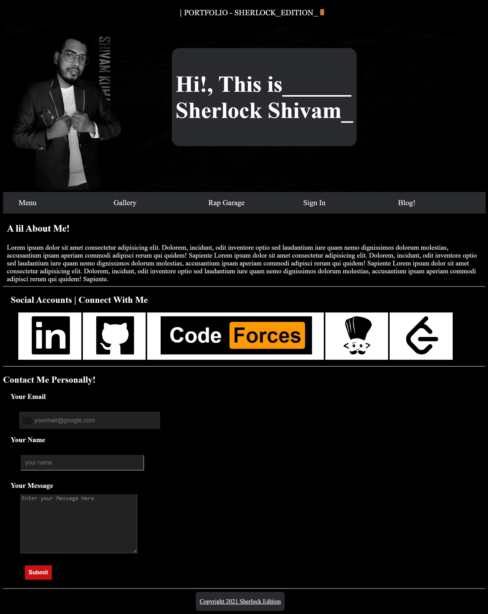
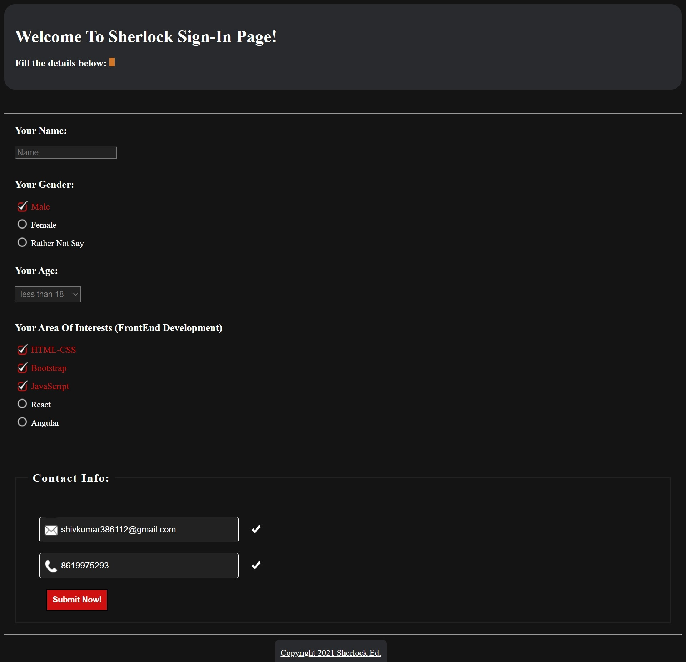

# Made a basic-responsive website by implementing Basic HTML and CSS, and styled the form section with custom input-tick images also.
## Home Page

## Sign-in Page

  

<a href="https://itsme-shivamkumar.github.io/Basic-HTML-CSS-Website/">Visit full site here</a>
